# Background

Terms used throughout:

- **Split** - a unit of input work wrapping one BigQuery Storage API *stream*. The stream yields a
  subset of the source table's rows; reading the split streams those rows into Flink. Row counts per
  stream vary. The enumerator hands splits to readers; each reader reads its splits sequentially. In
  these runs the table is partitioned into 3,000 streams → 3,000 splits.
- **Reader / registered reader** - a source subtask that has registered with the JobManager and will
  request splits.
- **Enumerator** - lives on the JobManager and hands out splits to readers on demand.
- **`NoMoreSplitsEvent`** - event the enumerator signals when the assigner is drained; tells a
  reader it can finish once its current split is done.

# What?

At high parallelism (≥ 1000 subtasks), two bugs in `BigQuerySourceEnumerator.assignSplits` compound
to produce silent row loss:

- **Bug 1** fails already-finishing reader tasks and returns their splits to the pool.
- **Bug 2** then reassigns those returned splits to reader tasks that have since terminated. The
  reassigned splits sit booked to dead tasks and are never re-read.

In our reproductions we saw 50 – 80M rows being silently dropped.

## Bug 1 - repeated `NoMoreSplitsEvent` signal broadcasts

When the enumerator finds the split assigner drained, it broadcasts `NoMoreSplitsEvent` to *every*
registered reader - including readers that have just finished on their TaskManager but whose
FINISHED notification has not yet reached the JobManager. Those event deliveries fail, the
JobManager marks the task FAILED, discards the output it already produced, and returns the splits it
processed to the pool via `addSplitsBack` for re-execution.

Normally, `NoMoreSplitsEvent` broadcasts only once. But at high parallelism (e.g. parallelism ≥
1000), some reader tasks take longer to initialize - Kubernetes may still be acquiring resources for
their TaskManagers. When these late readers come online and request a split, they find the pool
drained, and each such late request triggers its own `NoMoreSplitsEvent` broadcast. Those repeated
broadcasts are what catch tasks mid-transition and fail them.

## Bug 2 - stale `readersAwaitingSplit` entries

When a reader requests a split and the pool is empty, the enumerator triggers the broadcast
described in Bug 1 but does not remove the requesting reader from `readersAwaitingSplit`. The reader
has now been told no further splits are coming, so it finishes its current split (if any) and
transitions to FINISHED - but its stale entry remains in the queue.

Later, when the pool is refilled (by the failed tasks from Bug 1 returning their splits via
`addSplitsBack`), the enumerator drains `readersAwaitingSplit` to reassign. The stale entries are
handed splits, but the target reader has already FINISHED. No exception is raised; the split sits
booked to a dead task and is never read.

## Why both bugs have to be present

Bug 1 *creates the conditions* for Bug 2 to trigger - the failed tasks are what refill the pool and
re-invoke split assignment against a queue containing stale entries. Without Bug 1, reassignment is
rare and Bug 2 rarely fires.

Without Bug 2, Bug 1 would be just noisy retries - all splits eventually get re-read.

See the [detailed failure flow](#detailed-failure-flow) below.

# Solution

Rewrite the `noMoreSplits` branch of the `while` loop over `readersAwaitingSplit` in
`BigQuerySourceEnumerator.assignSplits`:

```
final Iterator<Integer> awaitingReader = readersAwaitingSplit.iterator();
while (awaitingReader.hasNext()) {
    int nextAwaiting = awaitingReader.next();
    // ... other branches (split available, reader unregistered) ...
    } else if (splitAssigner.noMoreSplits() && boundedness == Boundedness.BOUNDED) {
        LOG.info("Signal NoMoreSplits to subtask {}", nextAwaiting);
        context.signalNoMoreSplits(nextAwaiting);   // (1) fix Bug 1: signal only the requesting reader, not a broadcast
        awaitingReader.remove();                    // (2) fix Bug 2: remove the requesting reader from the queue
        break;
    }
}
```

# Validation

|                               |                      Pre-fix Run 1 |                      Pre-fix Run 2 |                      Pre-fix Run 3 |                     Post-fix Run 1 |                     Post-fix Run 2 |                     Post-fix Run 3 |
|-------------------------------|-----------------------------------:|-----------------------------------:|-----------------------------------:|-----------------------------------:|-----------------------------------:|-----------------------------------:|
| Job ID                        | `ad9670649392bdd7262252a511829b93` | `0df37a3ee1ebb342d8fa42a4aa808b17` | `1cb49738c8ef661ad79959fdd4d2acf4` | `1b04343511102bcff1509826cbdfe134` | `6b9b3373b617cd4bfa8ce3903ba835ed` | `3381fa5e74687b67400f5707f575b2d9` |
| BigQuery `streams count`      |                              3,000 |                              3,000 |                              3,000 |                              3,000 |                              3,000 |                              3,000 |
| `Assign split`                |                              3,073 |                              3,054 |                              3,074 |                              3,000 |                              3,000 |                              3,000 |
| `Read for split … completed`  |                              3,018 |                              3,012 |                              3,019 |                              3,000 |                              3,000 |                              3,000 |
| `RUNNING → FAILED` events     |                                 27 |                                 35 |                                 39 |                                  0 |                                  0 |                                  0 |
| `Discarding results` events ⁴ |                                 54 |                                 70 |                                 78 |                                  0 |                                  0 |                                  0 |
| `addSplitsBack` events        |                                 27 |                                 35 |                                 39 |                                  0 |                                  0 |                                  0 |
| Splits returned ¹             |                                 73 |                                 54 |                                 74 |                                  0 |                                  0 |                                  0 |
| Rows read ²                   |                      3,947,561,552 |                      3,965,256,750 |                      3,946,741,896 |                      4,021,548,951 |                      4,021,548,951 |                      4,021,548,951 |
| Rows missing ³                |                         73,987,399 |                         56,292,201 |                         74,807,055 |                              **0** |                              **0** |                              **0** |

¹ *Splits returned* = total splits handed back via `addSplitsBack` across all events. A single
failed task can return multiple in-flight splits at once, so this is ≥ `addSplitsBack events`. Each
returned split is reassigned, which is why `Assign split` = 3,000 + *Splits returned*.  
² *Rows read* comes from the Flink job output  
³ *Rows missing* = expected_source_rows − rows_read  
⁴ *`Discarding results` events* = counts of `Discarding the results produced by task execution ...`,
which Flink logs twice per failed task (once per result partition), so this is 2×
`RUNNING → FAILED`.

# Detailed failure flow

A minimal scenario that reproduces both bugs and loses one split's worth of
rows: **3 splits** (Split1, Split2, Split3) and **3 TaskManagers** (Task1
processes Split1 then Split3; Task2 processes Split2; Task3 late - Kubernetes
provisioning delay). Task2 finishes first and its `sendSplitRequest`
against the drained pool fires the first `NoMoreSplitsEvent` broadcast,
leaving a stale entry for Task2 in `readersAwaitingSplit` (Bug 2). Task3's
late `sendSplitRequest` re-triggers the broadcast - catching Task1
mid-FINISHED-transition (which leads to failover and `addSplitsBack`),
and leaving Task3 itself with a second stale entry in
`readersAwaitingSplit` once it processes its own `NoMoreSplitsEvent` and
finishes.

Stale entries are highlighted in **red** in the diagrams.
**Arrows** show events, method calls, exceptions, split assignments,
and row emissions - `sendSplitRequest`, `NoMoreSplitsEvent`,
`TaskNotRunningException`, output discard, FINISHED notification,
`context.assignSplit`, splits emitted to downstream output. Color signals
disposition: **green** for normal/positive flow, **red** for
failure/orphaned events, **black** for neutral.
**Numbered labels**
(`1.`, `2.`, …) indicate event ordering within a pane; repeated numbers
mean simultaneous events.

## t0: Job starts, Task3 resources still being provisioned

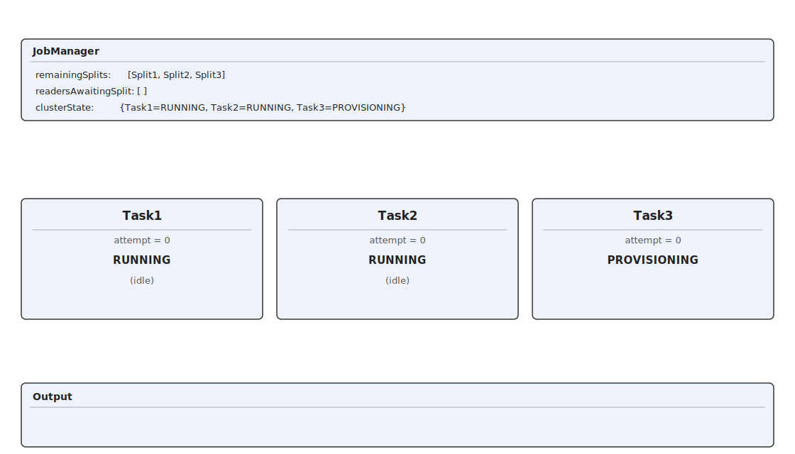

## t1: Requests queue up in `readersAwaitingSplit`

Task1 and Task2 each `sendSplitRequest`. The enumerator adds each to
`readersAwaitingSplit` before iterating the "queue" (not actually a queue but rather a `Set`) to
assign.


## t2: Enumerator drains `awaiting`, assigns splits

Enumerator iterates `readersAwaitingSplit`, assigning one split per reader and
removing the entry. `readersAwaitingSplit` queue empties; pool drops to `[Split3]`.


## t3: Task1 finishes Split1, requests queue up

Task1 finishes processing it's split first, emits Split1 rows, and another `sendSplitRequest`. The
enumerator adds Task1 to `readersAwaitingSplit` before iterating the queue to assign.

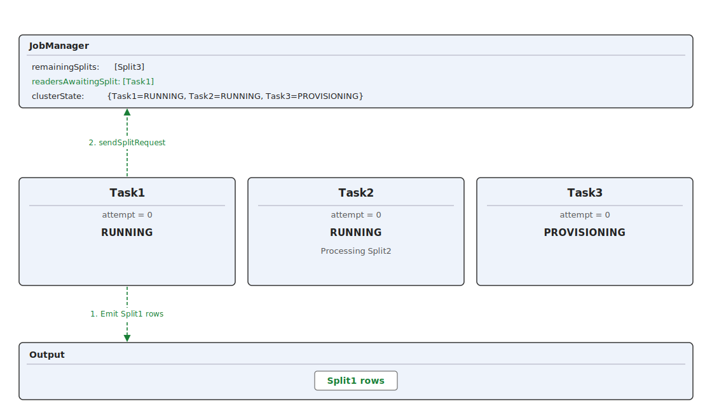

## t4: Enumerator drains `readersAwaitingSplit`, assigns Split3 to Task1

Enumerator iterates `readersAwaitingSplit`, assigns Split3 to Task1, and
removes the entry. Queue empties; pool drops to `[ ]`.


## t5: Task2 finishes Split2, requests queue up

Task2 finishes processing Split2, emits Split2 rows, and `sendSplitRequest`s again. The enumerator
adds Task2 to  `readersAwaitingSplit` before iterating the queue.

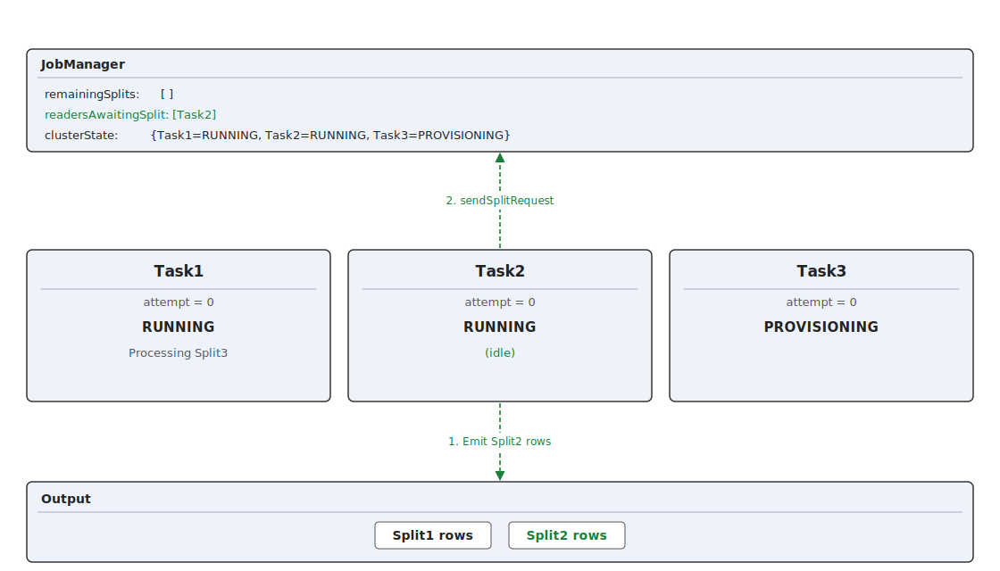

## t6: Bug 1 first fire, Bug 2 seeds the queue

Enumerator iterates the queue, finds the `remainingSplits` pool is empty, and **broadcasts**
`NoMoreSplitsEvent` to every registered reader (Task1, Task2) - and **does
not remove Task2 from the queue** (Bug 2 - the entry left in `readersAwaitingSplit`
becomes stale once Task2 finishes). Task2 processes the event and transitions
FINISHED on its TaskManager - but its FINISHED notification to the JobManager
hasn't arrived yet, so `clusterState` still shows `Task2=RUNNING`. Task1 notes
the event and keeps reading Split3.

- **Code path:** `BigQuerySourceEnumerator.assignSplits` (JobManager).
- **Side effect of `signalNoMoreSplits`:** sets `subtaskHasNoMoreSplits[i] = true`
  for every _currently-registered_ reader, so their subsequent `sendSplitRequest`s
  are silently dropped by
  [
  `SourceCoordinator.handleRequestSplitEvent`](https://github.com/apache/flink/blob/release-2.1/flink-runtime/src/main/java/org/apache/flink/runtime/source/coordinator/SourceCoordinator.java#L646-L659) -
  they cannot trigger another broadcast. The first broadcast is benign on its own
  (every target is RUNNING); danger comes from re-broadcasts via late-registering
  readers (t8).

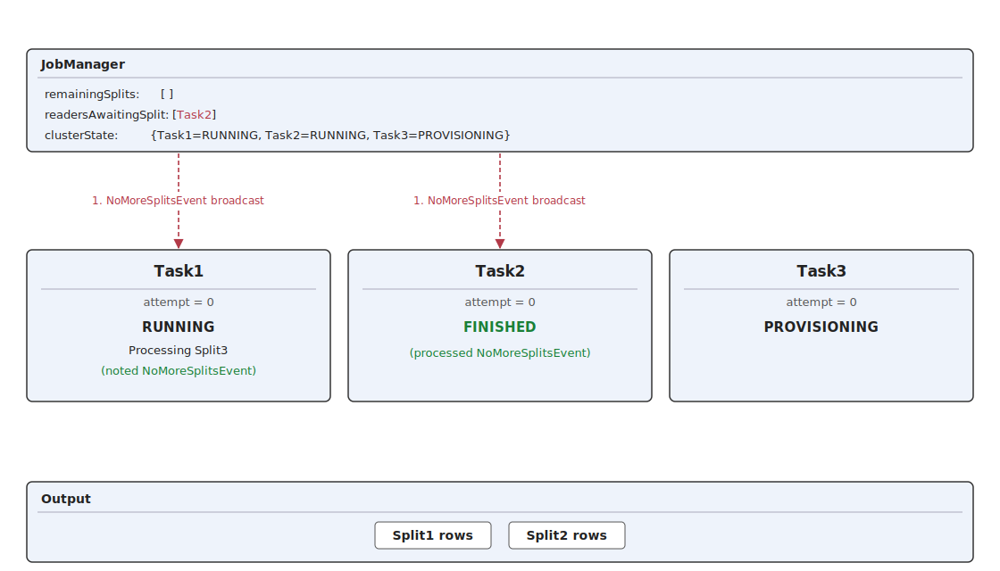

## t7: JobManager learns Task2 is FINISHED

Task2's FINISHED notification reaches the JobManager; `clusterState`
flips `Task2=RUNNING` → `Task2=FINISHED`. Task1 is still processing Split3.
Task3 is still provisioning.

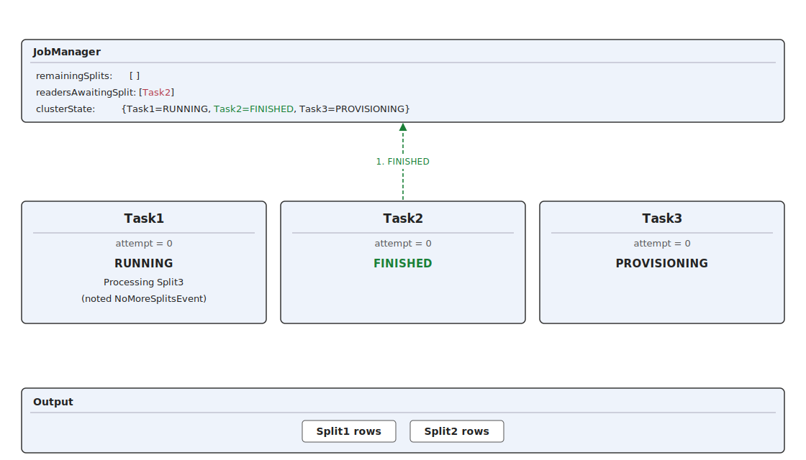

## t8: Task1 transitions FINISHED-on-TM, Task3 late-registers → Bug 1 **re-fires**

Task1 finishes processing Split3, emits Split3Rows, processed the `NoMoreSplits` event it received
at t6, and transitions from RUNNING to FINISHED on its TaskManager. Before the task is able to sent
it's "final execution state FINISHED" notification to update the JobManager's `clusterState` (or
while the notification is still in flight), Task3 finally registers and sends a `sendSplitRequest`
which reaches the enumerator, hits the drained pool, gets added to `readersAwaitingSplit` queue, and
triggers **another** `NoMoreSplitsEvent` broadcast to every registered reader. The broadcast catches
Task1 in the race window.

**Proof:** in a pre-fix run, the first three `signalNoMoreSplits` broadcasts fired at
14:36:00.075, .088, and .121 - to 581, 582, and 583 registered readers respectively -
*before* the first failure at 14:36:00.207. The registered-reader count grew 581→590
as late-arriving attempt_0 readers registered and each triggered its own cascade:
their `subtaskHasNoMoreSplits` slot was still `false` (never flipped by the prior
broadcasts, which only covered the subtask indices that had registered at the time),
so their `sendSplitRequest` sailed through the gate in `handleRequestSplitEvent`,
re-hit the drained assigner, and re-broadcast to all registered readers.

### How a late-registering reader bypasses the gate

`SourceCoordinatorContext.subtaskHasNoMoreSplits` is pre-sized
`new boolean[parallelism]` and initialized all-false
([
`SourceCoordinatorContext.java:570-571`](https://github.com/apache/flink/blob/release-2.1/flink-runtime/src/main/java/org/apache/flink/runtime/source/coordinator/SourceCoordinatorContext.java#L570-L571)),
so any subtask whose `handleReaderRegistrationEvent` fires *after* the first broadcast
has its slot still at `false`; its `sendSplitRequest` sails through the
`!context.hasNoMoreSplits(subtask)` gate in
[
`handleRequestSplitEvent`](https://github.com/apache/flink/blob/release-2.1/flink-runtime/src/main/java/org/apache/flink/runtime/source/coordinator/SourceCoordinator.java#L655-L657),
reaches the enumerator, re-hits the drained assigner, and fires another broadcast.

### Race window

The race window the broadcast catches Task1 in is bounded by two simultaneous in-flight events

- **TaskManager's RUNNING→FINISHED transition.** Task1 must have already reacted
  to the first broadcast - processed `NoMoreSplitsEvent`, finished its last split,
  and transitioned RUNNING→FINISHED on its TaskManager. Otherwise the event would be
  accepted normally.
- **JobManager's unregister round-trip.** Task1's "final execution state FINISHED"
  notification (TaskManager → JobManager → coordinator drops reader from
  `registeredReaders`) must still be in flight. Otherwise the broadcast would no
  longer target Task1.

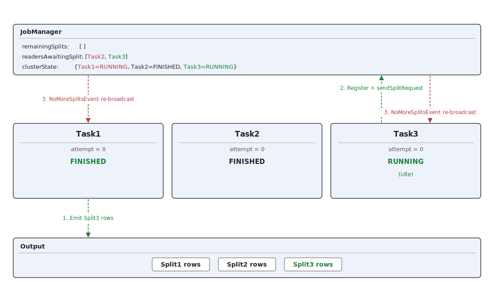

## t9: Delivery to Task1 fails → task failover

Because Task1 is already finished, the `NoMoreSplitsEvent` delivery to Task1 raises a
`TaskNotRunningException` on
the TaskManager. `SubtaskGatewayImpl.sendEvent`'s completion handler
sees the failure and - because JM-side `Execution.state` is still
`RUNNING` - `isStillRunning()` returns true, so it raises the "event
lost" `FlinkException`. The JobManager transitions Task1 RUNNING→FAILED,
**discards** its outputs for Split1 and Split3, returns the splits to
the pool via `addSplitsBack(Split1, Split3)`, and schedules a restart
of the task.

Meanwhile Task3 - which received the re-broadcast in t8 -
processes its `NoMoreSplitsEvent`, transitions FINISHED, and notifies
the JobManager. Now **both** Task2 and Task3 have stale entries in
`readersAwaitingSplit` from their earlier `sendSplitRequest`s that were
never removed (Bug 2).

- **Code path (exception thrown):** `Task.deliverOperatorEvent` (TaskManager).
- **Code path ("event lost" wrap):** `SubtaskGatewayImpl.sendEvent` (JobManager) -
  any undelivered operator event to a task that the JobManager still recognizes as
  RUNNING is treated as a consistency violation. See
  [Flink's "event lost" guard](#flinks-event-lost-guard) for the exact source.
- **Code path (failover):** JobManager scheduler →
  `SourceCoordinator.subtaskReset` (`SourceCoordinator.java:368`) - marks the execution
  FAILED, discards output, clears `subtaskHasNoMoreSplits[i]`, calls
  `enumerator.addSplitsBack(splits_i)` to return in-flight splits to
  `remainingSourceSplits`, and schedules the next attempt.
- **Important:** although successfully produced rows are thrown away, `addSplitsBack`
  returns the splits that produced those rows back to the pool so they can be re-read
  in the next attempt. Whether this re-read succeeds is decided in t10–t11.

**Proof:** we observed the race directly in a separate pre-fix run (~204 M rows
missing, same workload as the validation table). One TaskManager's slot (allocation
id `87a1325c51462432b2ff533b863e048e`) hosted two source subtasks in sequence; both
finished successfully and both were then marked FAILED by the JobManager.

| Time (EDT)      | Event                                                                                                                                                                                                                                 |
|-----------------|---------------------------------------------------------------------------------------------------------------------------------------------------------------------------------------------------------------------------------------|
| 08:10:10.2      | JobManager: subtask 156/1000 CREATED→SCHEDULED                                                                                                                                                                                        |
| 08:10:10        | Pod `flink-taskmanager-1-218` created (`WorkerResourceSpec{cpu=1.0, numSlots=1, ...}`)                                                                                                                                                |
| 08:10:40        | TaskManager container starts                                                                                                                                                                                                          |
| 08:10:56.8      | TaskManager registered at ResourceManager (pekko endpoint `252.206.70.75:6122`)                                                                                                                                                       |
| 08:10:57.5      | JobManager: 156/1000 DEPLOYING → deployed to TaskManager-1-218 with allocation `87a1325c...`                                                                                                                                          |
| 08:11:11.3      | 156/1000 INITIALIZING→**RUNNING** on TaskManager                                                                                                                                                                                      |
| 08:12:54.814    | 156/1000 RUNNING→**FINISHED** on TaskManager - task completed normally                                                                                                                                                                |
| 08:12:54.814    | TaskManager: `Freeing task resources for Source: source_data[1] (156/1000)#0`                                                                                                                                                         |
| 08:12:54.852    | TaskManager: "Un-registering task and sending final execution state FINISHED to JobManager"                                                                                                                                           |
| ~08:12:54.85    | JobManager: `signalNoMoreSplits` broadcast fires (252 broadcasts in the 08:12:50–08:13:00 buckets)                                                                                                                                    |
| ~08:12:54.90    | JobManager → TaskManager: `SubtaskGatewayImpl.sendEvent(NoMoreSplitsEvent)` → `TaskExecutor.sendOperatorEventToTask` → `Task.deliverOperatorEvent` rejects with `TaskNotRunningException: Task is not running, but in state FINISHED` |
| 08:12:54.905    | JobManager: 156/1000 RUNNING→**FAILED** with `FlinkException: An OperatorEvent from an OperatorCoordinator to a task was lost. Triggering task failover to ensure consistency. Event: '[NoMoreSplitsEvent]'`                          |
| 08:12:54.906    | JobManager: **"Discarding the results produced by task execution ... _155_0"** - successfully produced output is thrown away                                                                                                          |
| 08:12:54.906    | JobManager: "1 tasks will be restarted to recover the failed task"                                                                                                                                                                    |
| 08:12:55.79     | Attempt #1 of 156/1000 CREATED→SCHEDULED                                                                                                                                                                                              |
| 08:12:59.21     | Subtask 867/1000 (a different parallel instance) deploys into the now-free slot on TaskManager-1-218 - same allocation id `87a1325c...`                                                                                               |
| 08:12:59.23     | 867/1000 INITIALIZING→RUNNING                                                                                                                                                                                                         |
| 08:13:00.21     | Attempt #1 of 156/1000 DEPLOYING on `flink-taskmanager-1-203`                                                                                                                                                                         |
| 08:13:00.23     | Attempt #1 of 156/1000 RUNNING                                                                                                                                                                                                        |
| 08:13:00.52     | 867/1000 RUNNING→**FINISHED** on TaskManager-1-218 (ran for ~1.3 s)                                                                                                                                                                   |
| 08:13:01.24     | JobManager: 867/1000 RUNNING→**FAILED** with the same `NoMoreSplitsEvent` lost-operator-event exception                                                                                                                               |
| **08:13:01.77** | Attempt #1 of 156/1000 RUNNING→**FINISHED** on TaskManager-1-203 (ran for ~1.5 s)                                                                                                                                                     |
| 08:19:52.287    | At job shutdown, RM: "Disconnect TaskExecutor flink-taskmanager-1-218 because: ... has no more allocated slots for job"                                                                                                               |
| 08:19:52.605    | TaskManager: `FlinkException: The TaskExecutor's registration at the ResourceManager has been rejected` (normal batch-job teardown, unrelated to data loss)                                                                           |

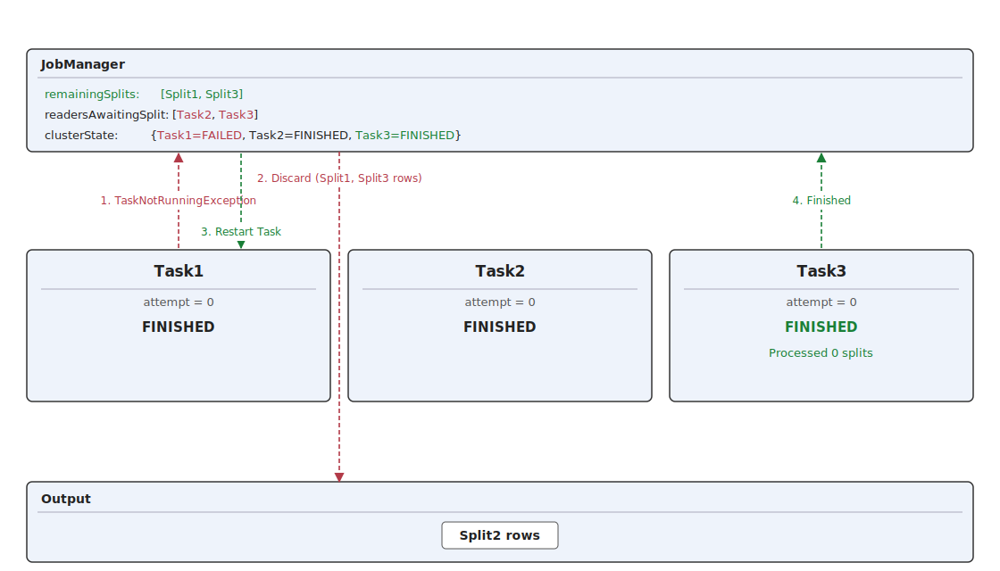

## t10: Task1 attempt_1 registers and requests a split

The restart progresses: Task1 attempt = 1 is deployed and reaches RUNNING.
It registers with the JobManager and sends `sendSplitRequest`. The
enumerator appends Task1 to `readersAwaitingSplit`, which now holds
**three** entries: the two stale entries for Task2 and Task3 (both
already FINISHED, shown in red) and the live entry for Task1
attempt = 1. The pool still holds Split1 and Split3.

- **Why the request reaches the enumerator:** the `subtaskHasNoMoreSplits[i]` flag
  was cleared during the failover (`resetSubtask`) in t9, so the new attempt's `sendSplitRequest`
  passes the gate.

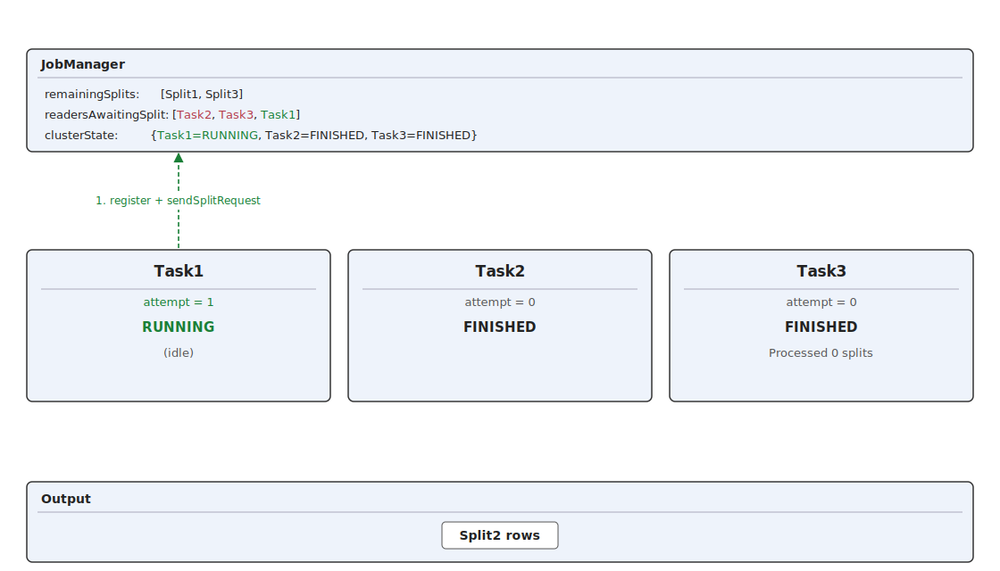

## t11: Queue drains - Task1 gets Split1, Bug 2 orphans Split3

The enumerator drains the queue against the refilled pool. Task1
attempt = 1 is assigned Split1 (green) and starts reading it. Then
Task2 (stale, next in queue) is assigned Split3 - Task2 is already
JobManager-FINISHED, so `isStillRunning()` returns false and the
delivery is silently absorbed (red). No failover, **Split3 is booked
to a dead task and never read**.

- **Why this is the data-loss step:** the iterator would be safe if
  `readersAwaitingSplit` accurately reflected RUNNING tasks, but it doesn't - any
  task that hit the `noMoreSplits` branch previously was never removed (Bug 2),
  so the queue can contain stale entries pointing to tasks that have since FINISHED.
  The outcome of each delivered split now depends on the target subtask's state:
    - **Branch (A) - target subtask still RUNNING and awaiting work:** receives
      `Adding split(s) to reader`, reads the split normally. No orphan.
      (Task1 attempt_1 with Split1 here.)
    - **Branch (B) - target subtask already JobManager-FINISHED** (transitioned
      during the cascade): the event is silently absorbed - no
      `TaskNotRunningException`-driven restart (see
      [Flink's "event lost" guard](#flinks-event-lost-guard)), no new attempt.
      The split sits booked to a dead task and is never read, resulting in data
      loss. (Task2 with Split3 here.)

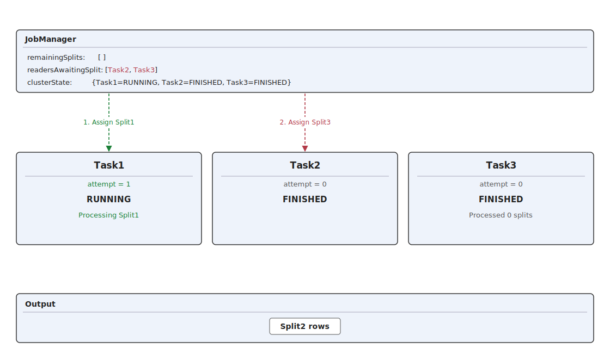

## t12: Task1 attempt=1 wraps up - request, NoMoreSplits, emit, finish

Task1 attempt=1 finishes its work in four steps: (1) it sends another
`sendSplitRequest`; (2) the pool is empty so the enumerator broadcasts
`NoMoreSplitsEvent` back to Task1; (3) Task1 emits Split1's rows to the
output; (4) Task1 transitions FINISHED and notifies the JobManager. The
stale entries (Task2 and Task3) remain in `readersAwaitingSplit` - they
are benign now that the pool is drained.

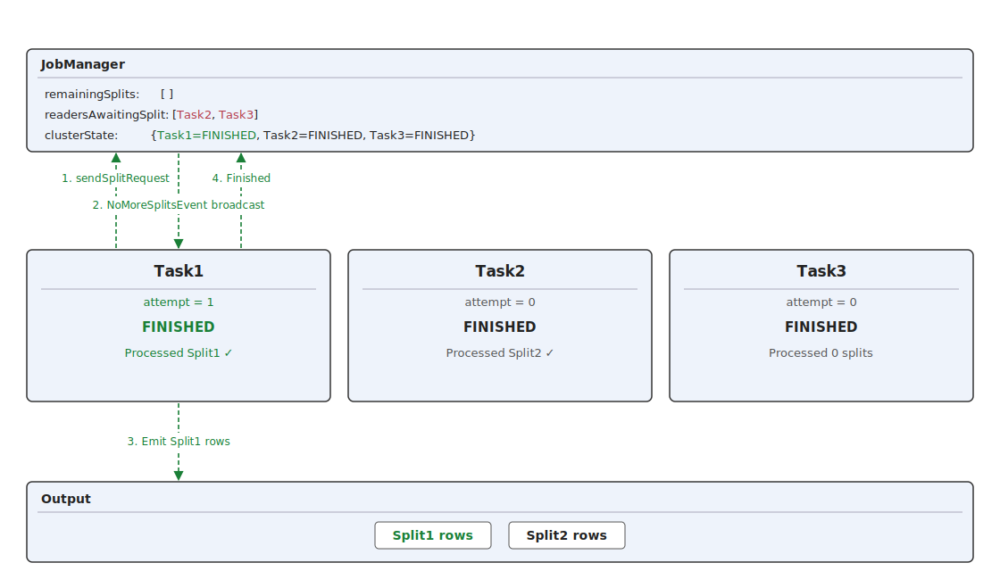

## t13: Final state - data loss limited to Split3

All tasks are now FINISHED from the JobManager's point of view, so the job progresses to whatever is
the next operatoor in the DAG. Split1 (was recovered by attempt=1) and Split2
(Task2's original read) are in the output. Split3 - orphaned to
Task2's stale queue entry in t11 - was never re-read. That is the
data loss.

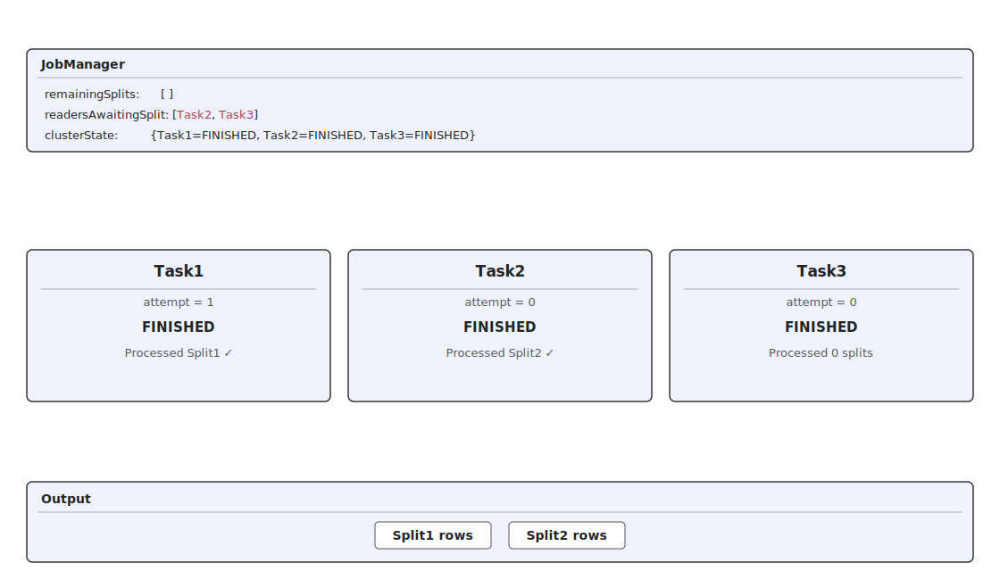

# Flink's "event lost" guard

The
`FlinkException("An OperatorEvent from an OperatorCoordinator to a task was lost. Triggering task failover to ensure consistency. ...")`
exception is raised in the completion handler attached inside
`SubtaskGatewayImpl.sendEvent` ([
`SubtaskGatewayImpl.java:111-132`](https://github.com/apache/flink/blob/release-2.1/flink-runtime/src/main/java/org/apache/flink/runtime/operators/coordination/SubtaskGatewayImpl.java#L111-L132)):

```
sendResult.whenCompleteAsync(
    (success, failure) -> {
        if (failure != null && subtaskAccess.isStillRunning()) {   // <-- guard
            // ... triggerTaskFailover(new FlinkException(EVENT_LOSS_ERROR_MESSAGE, failure))
        }
    },
    mainThreadExecutor);
```

`isStillRunning()` ([
`ExecutionSubtaskAccess.java:96-99`](https://github.com/apache/flink/blob/release-2.1/flink-runtime/src/main/java/org/apache/flink/runtime/operators/coordination/ExecutionSubtaskAccess.java#L96-L99))
is defined as:

```java
public boolean isStillRunning() {
    return taskExecution.getState() == ExecutionState.RUNNING
            || taskExecution.getState() == ExecutionState.INITIALIZING;
}
```

So if the JobManager-side `Execution.state` is already `FINISHED` at the time the send completes,
the failure is silently swallowed - no failover, no `FlinkException` raised.

## Why Bug 1 triggers the exception

Bug 1 is the `NoMoreSplitsEvent` delivery in step 3. When that delivery's failure callback fires,
the JobManager-side `Execution.state` is still `RUNNING`: the TaskManager has already transitioned
RUNNING→FINISHED locally, but its "final execution state FINISHED" notification back to the
JobManager
is still in flight, so the JobManager hasn't updated `state` yet. `isStillRunning()` returns `true`,
`triggerTaskFailover` runs, the `FlinkException` surfaces, and the attempt transitions
RUNNING→FAILED.

This is the narrow window (TaskManager-FINISHED ∧ JobManager-RUNNING) that makes Bug 1 observable at
all.

## Why Bug 2 Branch (B) does not trigger the exception

Bug 2 branch (B) is the `AddSplitEvent` delivery in step 7. By the time step 7 runs, the JobManager
has
long since observed the FINISHED transition - the TaskManager → JobManager round-trip completed
several hundred
milliseconds earlier (e.g. subtask 115 JobManager-FINISHED at 12:13:02.499, reassignment at
12:13:03.281). `isStillRunning()` returns `false`, the failure is silently absorbed, and no
failover or new attempt is scheduled.
